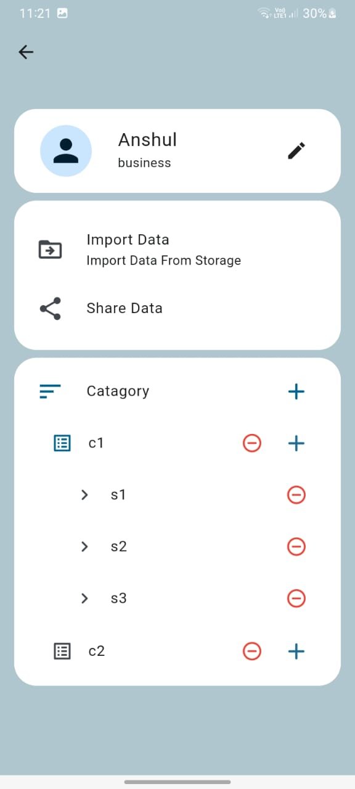
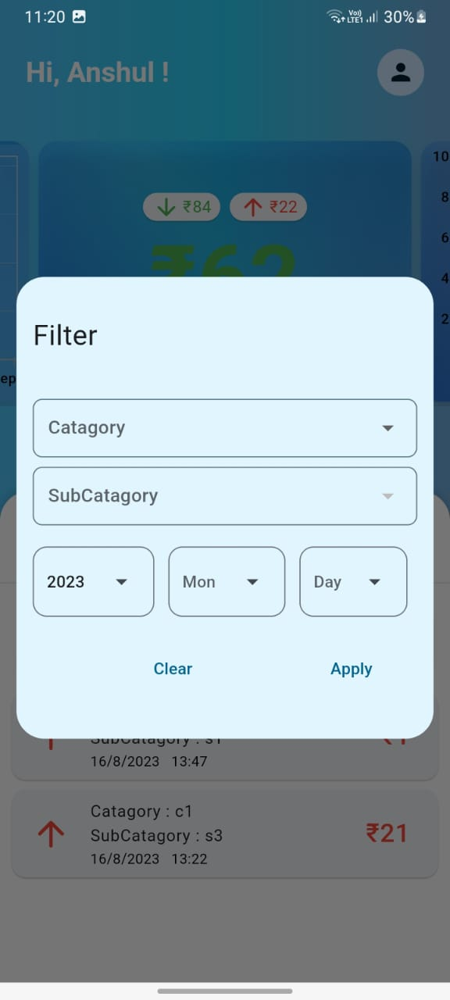
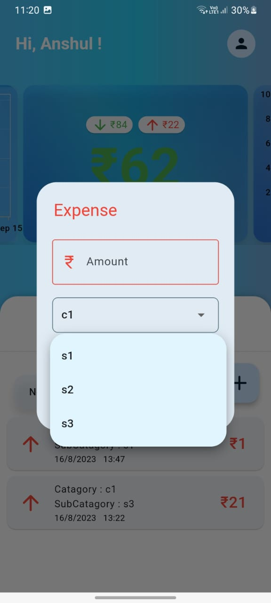
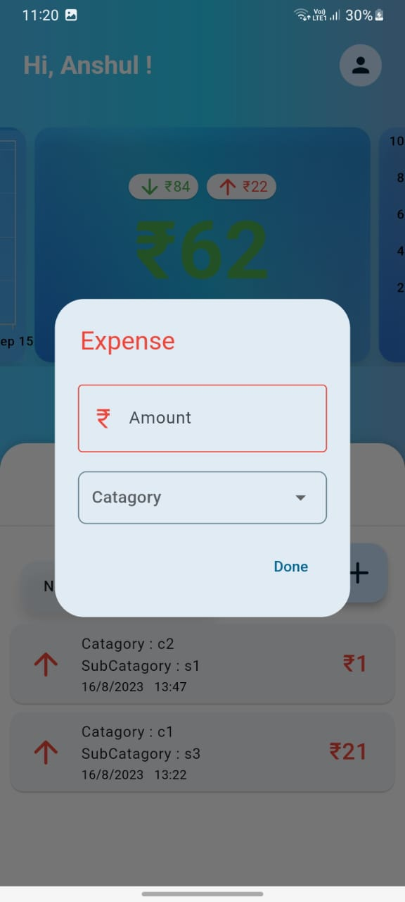
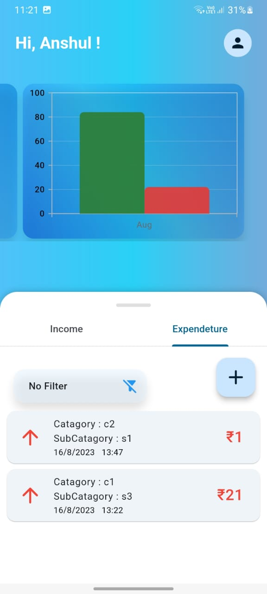
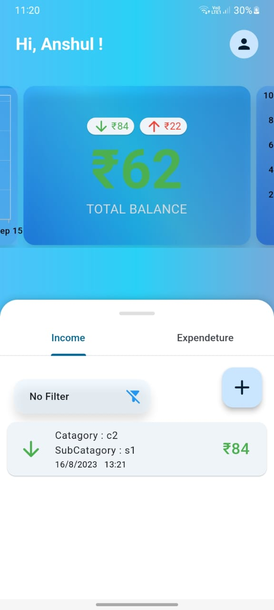

# Flutter Accounts Management Application

## Description
This Flutter project is an accounts management application designed for Android and iOS devices. It allows users to track their income and expenses, providing a convenient way to manage their personal finances.

---
<div style="display: flex; justify-content: center;">
    
    
    
    
    
    
</div>

---

## Features
2. Dashboard
   - Overview of income and expenses
   - Charts and graphs for visual representation
   - Current account balance

3. Income Management
   - Add new income transactions
   - Categorize income sources (e.g., salary, freelance work, investments)

4. Expense Management
   - Add new expense transactions
   - Categorize expenses (e.g., groceries, utilities, transportation)

5. Reports and Analysis
   - Generate reports based on income and expenses
   - Analyze spending patterns and trends
   - Set budget goals and track progress

## Installation
1. Ensure you have Flutter SDK installed on your system. If not, follow the official Flutter installation guide: [Flutter Installation Guide](https://flutter.dev/docs/get-started/install)

2. Clone the repository:
   ```bash
   git clone <https://github.com/EnthusiasticXcoder/Android-Accounts-Management-Application>
   ```

3. Change to the project directory:
   ```bash
   cd Android-Accounts-Management-Application
   ```

4. Fetch the project dependencies:
   ```bash
   flutter pub get
   ```

5. Run the application:
   ```bash
   flutter run
   ```

## Contributing
Contributions are welcome! If you'd like to contribute to this project, please follow these steps:

1. Fork the repository.
2. Create a new branch for your feature or bug fix.
3. Make your changes and commit them with descriptive commit messages.
4. Push your changes to your forked repository.
5. Submit a pull request to the main repository.

## License
This project is licensed under the MIT License. See the [LICENSE](LICENSE) file for more details.

## Acknowledgements
- [Flutter](https://flutter.dev/) - UI toolkit for building beautiful applications